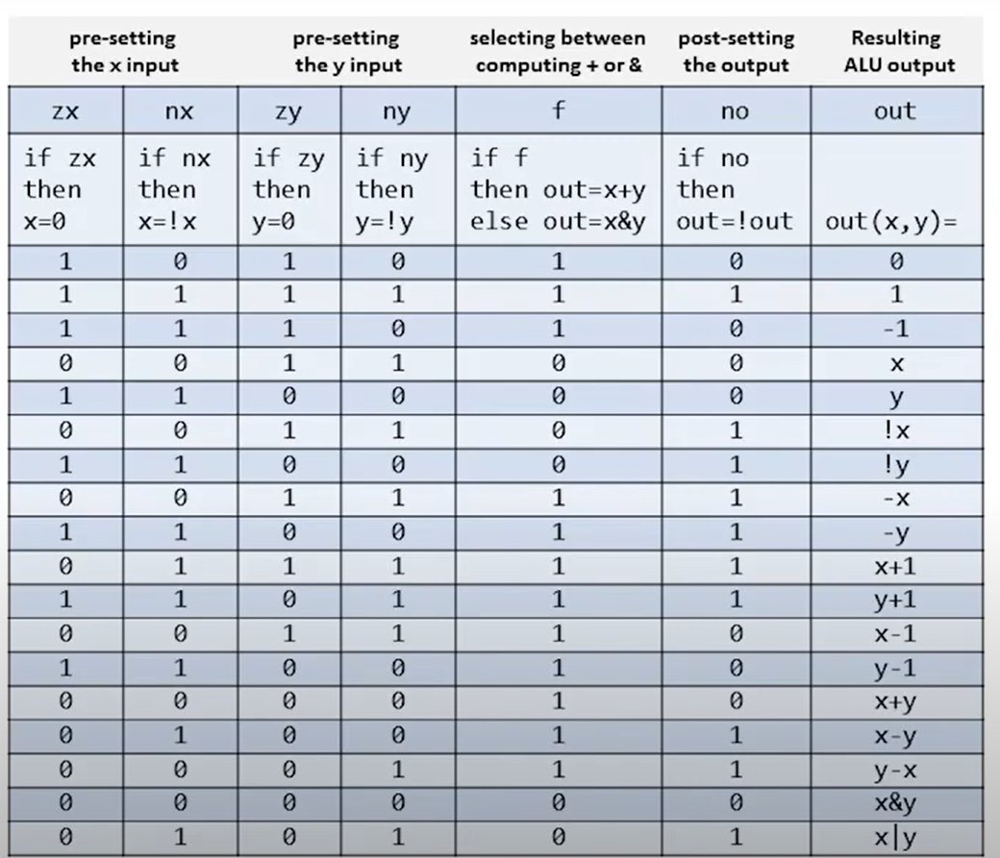

# 💡 半加器与全加器

## 加减乘除

下面，我们利用c++来说明加法可以实现减法乘法和除法\~\~\~

```cpp
#include <bits/stdc++.h>
using namespace std;

class Solution
{
public:
    int add(int a, int b)
    {
        if (b == 0)
            return a;
        return add(a ^ b, (a & b) << 1);
    }
    int sub(int a, int b)
    {
        return add(a, add(~b, 1));
    }
    int multiply(int a, int b)
    {
        int x = a >= 0 ? a : add((~a), 1);
        int y = b >= 0 ? b : add((~b), 1);
        int res = 0;
        while (y)
        {
            if (y & 1)
                res = add(res, x);
            x <<= 1;
            y >>= 1;
        }
        return (a ^ b) > 0 ? res : add(~res, 1);
    }
    int divide(int a, int b)
    {
        int x = a >= 0 ? a : add((~a), 1);
        int y = b >= 0 ? b : add((~b), 1);
        int res = 0;
        for (int i = 31; i >= 0; i--)
        {
            if (x >> i >= y)
            {
                x = sub(x, y << i);
                res = add(res, 1 << i);
            }
        }
        int reminder = (a ^ b) > 0 ? x : add((~x), 1);
        cout << a << "/" << b << " reminder: " << reminder;
        return (a ^ b) > 0 ? res : add((~res), 1);
    }
};
```

就是这么的神奇！你可能会疑惑关于加法的实现（加法需要异或、与、左移、递归），但是我们现在并不关心加法的实现（下面我们会给出16位全加器的实现），你只需要知道有了加法就可以进行减法、乘法和除法就OK啦！

&#x20;

### 半加器

半加器就是计算a，b两个bit的和还有进位。sum通过异或计算得到（还记得异或吗？就是不进位的加法啦\~，xor：a，b不同则为1，相同则为0），carry只有在a，b均为1的时候才为1（这不就是And吗\~\~）

```
/**
 * Computes the sum of two bits.
 */

CHIP HalfAdder {
    IN a, b;    // 1-bit inputs
    OUT sum,    // Right bit of a + b 
        carry;  // Left bit of a + b

    PARTS:
    Xor(a = a, b = b, out = sum);
    And(a = a, b = b, out = carry);
}

```


### 全加器

半加器只有两个输入，a和b。但实际上二进制的加法还有一个进位（carry），也就是三个输入，两个输出（sum，carry）。但是也很简单啦，只需要让a+b的sum 加上 低位来的carry就可以了，也就是2个半加器就可以实现一个全加器！

```
/**
 * Computes the sum of three bits.
 */

CHIP FullAdder {
    IN a, b, c;  // 1-bit inputs
    OUT sum,     // Right bit of a + b + c
        carry;   // Left bit of a + b + c

    PARTS:
    HalfAdder(a = a, b = b, sum = s1, carry = c1);
    HalfAdder(a = s1, b = c, sum = sum, carry = c2);
    Xor(a = c1, b = c2, out = carry);
}
```

## 16位全加器

```
/**
 * Adds two 16-bit values.
 * The most significant carry bit is ignored.
 */

CHIP Add16 {
    IN a[16], b[16];
    OUT out[16];

    PARTS:
    HalfAdder(a = a[0], b = b[0], sum = out[0], carry = c0);
    FullAdder(a = a[1], b = b[1], c = c0, sum = out[1], carry = c1);
    FullAdder(a = a[2], b = b[2], c = c1, sum = out[2], carry = c2);
    FullAdder(a = a[3], b = b[3], c = c2, sum = out[3], carry = c3);
    FullAdder(a = a[4], b = b[4], c = c3, sum = out[4], carry = c4);
    FullAdder(a = a[5], b = b[5], c = c4, sum = out[5], carry = c5);
    FullAdder(a = a[6], b = b[6], c = c5, sum = out[6], carry = c6);
    FullAdder(a = a[7], b = b[7], c = c6, sum = out[7], carry = c7);
    FullAdder(a = a[8], b = b[8], c = c7, sum = out[8], carry = c8);
    FullAdder(a = a[9], b = b[9], c = c8, sum = out[9], carry = c9);
    FullAdder(a = a[10], b = b[10], c = c9, sum = out[10], carry = c10);
    FullAdder(a = a[11], b = b[11], c = c10, sum = out[11], carry = c11);
    FullAdder(a = a[12], b = b[12], c = c11, sum = out[12], carry = c12);
    FullAdder(a = a[13], b = b[13], c = c12, sum = out[13], carry = c13);
    FullAdder(a = a[14], b = b[14], c = c13, sum = out[14], carry = c14);
    FullAdder(a = a[15], b = b[15], c = c14, sum = out[15], carry = c15);
}
```

就是这么简单\~。除了第0位（计算机从计数从0开始\~）无进位输入，是一个半加器之外，其它的都是全加器\~。你可能会疑惑如果第15位计算发生了进位怎么办？答案是：凉拌，这意味着发生了溢出！！全加器无法处理溢出的情况，也就意味着如果你想得到一个正确的输出，你必须要确保你的结果是不会发生溢出的！


### ALU

终于我们来到了ALU的部分，ALU输入包括两个需要计算的数字a，b还有一些状态位（用来控制到底进行什么计算），输出包括结果out，还有两个状态位。我们直接给出“表格”，通过这个表格，你就可以实现一些计算了！！！

<figure><figcaption></figcaption></figure>

<figure><figcaption></figcaption></figure>

```
/**
 * The ALU (Arithmetic Logic Unit).
 * Computes one of the following functions:
 * x+y, x-y, y-x, 0, 1, -1, x, y, -x, -y, !x, !y,
 * x+1, y+1, x-1, y-1, x&y, x|y on two 16-bit inputs, 
 * according to 6 input bits denoted zx,nx,zy,ny,f,no.
 * In addition, the ALU computes two 1-bit outputs:
 * if the ALU output == 0, zr is set to 1; otherwise zr is set to 0;
 * if the ALU output < 0, ng is set to 1; otherwise ng is set to 0.
 */

// Implementation: the ALU logic manipulates the x and y inputs
// and operates on the resulting values, as follows:
// if (zx == 1) set x = 0        // 16-bit constant
// if (nx == 1) set x = !x       // bitwise not
// if (zy == 1) set y = 0        // 16-bit constant
// if (ny == 1) set y = !y       // bitwise not
// if (f == 1)  set out = x + y  // integer 2's complement addition
// if (f == 0)  set out = x & y  // bitwise and
// if (no == 1) set out = !out   // bitwise not
// if (out == 0) set zr = 1
// if (out < 0) set ng = 1

CHIP ALU {
    IN  
        x[16], y[16],  // 16-bit inputs        
        zx, // zero the x input?
        nx, // negate the x input?
        zy, // zero the y input?
        ny, // negate the y input?
        f,  // compute out = x + y (if 1) or x & y (if 0)
        no; // negate the out output?

    OUT 
        out[16], // 16-bit output
        zr, // 1 if (out == 0), 0 otherwise
        ng; // 1 if (out < 0),  0 otherwise

    PARTS:
    // zx
    Mux16(a = x, b = false, sel = zx, out = x1);

    // nx
    Not16(in = x1, out = x2);
    Mux16(a = x1, b = x2, sel = nx, out = x3);

    // zy
    Mux16(a = y, b = false, sel = zy, out = y1);

    // ny
    Not16(in = y1, out = y2);
    Mux16(a = y1, b = y2, sel = ny, out = y3);

    // f
    And16(a = x3, b = y3, out = f1);
    Add16(a = x3, b = y3, out = f2);
    Mux16(a = f1, b = f2, sel = f, out = o1);

    // no
    Not16(in = o1, out = o2);
    Mux16(a = o1, b = o2, sel = no, out = out, out = o3);
 
    // zr
    Or16Way(in = o3, out = zr1);
    Not(in = zr1, out = zr);

    // ng
    IsNeg(in = o3, out = ng);
}
```

```
/**
 * 16-way Or: 
 * out = (in[0] or in[1] or ... or in[15])
 */

CHIP Or16Way {
    IN in[16];
    OUT out;

    PARTS:
    Or(a = in[0], b = in[1], out = o1);
    Or(a = o1, b = in[2], out = o2);
    Or(a = o2, b = in[3], out = o3);
    Or(a = o3, b = in[4], out = o4);
    Or(a = o4, b = in[5], out = o5);
    Or(a = o5, b = in[6], out = o6);
    Or(a = o6, b = in[7], out = o7);
    Or(a = o7, b = in[8], out = o8);
    Or(a = o8, b = in[9], out = o9);
    Or(a = o9, b = in[10], out = o10);
    Or(a = o10, b = in[11], out = o11);
    Or(a = o11, b = in[12], out = o12);
    Or(a = o12, b = in[13], out = o13);
    Or(a = o13, b = in[14], out = o14);
    Or(a = o14, b = in[15], out = out);
}
```

```
CHIP IsNeg {

    IN in[16];
    OUT out;

    PARTS:
    Or(a = in[15], b = false, out = out);
}
```

```
/**
 * 16-bit incrementer:
 * out = in + 1 (arithmetic addition)
 */

CHIP Inc16 {
    IN in[16];
    OUT out[16];

    PARTS:
    Add16(a = in, b[0] = true, b[1..15] = false, out = out);
}
```
