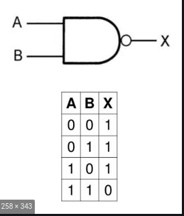

# 💡 与非门与其它逻辑门

## **与非门**&#x20;

在真实的物理世界中，如何利用电阻、电容和电感构建出一个与非门有许多种方案。但实际上我们并不关心如何搭建出一个与非门（学会抽象的记忆），我们唯一需要关心的就是与非门的符号与真值表（对输入A和B先与再非，就这么简单）。

<figure><figcaption><p>与非门是最基本的逻辑电路，通过与非门可以构建出其它的逻辑门电路（例如与、或、非）等等。</p></figcaption></figure>

## 其它的逻辑门电路

利用与非门就可以构建出其它的逻辑门，这是如何实现的呢？为了方便抽象化理解，我们引入HDL（硬件描述语言）来描述其它逻辑门。下面我们给出其它逻辑门的实现，（之后你只需要记住每一种逻辑门能够实现什么功能，而无需关注其具体是怎么利用nand门构建的，也就是学会“抽象”的记忆）

* 非门

第一次看到HDL你可能感觉到非常困惑，但实际上HDL非常简单，实际上你必须需要要记住的是输入是什么，输出是什么！逻辑原理，需要边理解边记忆。

HDL语言的核心内容是（就这么简单，实现逻辑写在PARTS里面）：

1、CHIP名（Not）

2、输入IN 输入变量 in

3、输出OUT 输出变量 out

如何利用Nand门实现Not门呢？ out = !in = Nand(in, in)

Nand门有两个输入a，b，一个输出out。out == Nand(a,b) == !(a^b)

为什么呢？Nand门做的操作就是“先与再非”，in与in还是in，然后取非就得到了“非in”，就这么简单。

```
/**
 * Not gate:
 * out = not in
 */

CHIP Not {
    IN in;
    OUT out;

    PARTS:
    Nand(a = in, b = in, out = out);
}
```

* And 门

由于And(a,b)就是Nand(a,b)再取一个非。因此我们只需要 Not(Nand(a,b))就可以了。

```
/**
 * And gate: 
 * out = 1 if (a == 1 and b == 1)
 *       0 otherwise
 * And = Nand(Nand(a, b), Nand(a, b))
 */

CHIP And {
    IN a, b;
    OUT out;

    PARTS:
    Nand(a = a, b = b, out = o1);
    Nand(a = a, b = b, out = o2);
    Nand(a = o1, b = o2, out = out);
    /**另一种写法,利用之前的Not门！（抽象开始起作用了）
    * Nand( a = a, b = b, out = o1);
    * Not( in = o1, out = out);
    */
}

```

* Or 门。 （简单的德摩根定律, 还是那句话只需要抽象的记忆输入与输出！）

&#x20;!( !(a) ^ !(b) ) == !!(a) | !!(b) == a | b

```
 /**
 * Or gate:
 * out = 1 if (a == 1 or b == 1)
 *       0 otherwise
 * 思路: Or = Nand(Not(a), Not(b))
 */

CHIP Or {
    IN a, b;
    OUT out;

    PARTS:
    Not(in = a, out = o1);
    Not(in = b, out = o2);
    Nand(a = o1, b = o2, out = out);
}

```

* Xor 门

异或门，a，b不同则为1，a，b相同则为0。有时候又称为半加运算\~\~\~。

```
/**
 * Exclusive-or gate:
 * out = not (a == b)
 * 思路: Xor = Or(And(a, Not(b)), And(Not(a), b))
 */

CHIP Xor {
    IN a, b;
    OUT out;

    PARTS:
    Not(in = b, out = n0);
    And(a = a, b = n0, out = a0);
    Not(in = a, out = n1);
    And(a = n1, b = b, out = a1);
    Or(a = a0, b = a1, out = out);
}
```
